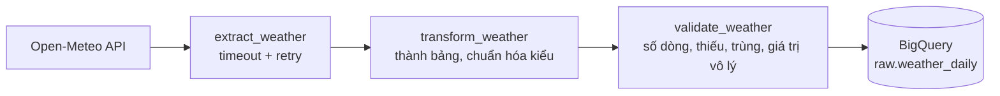
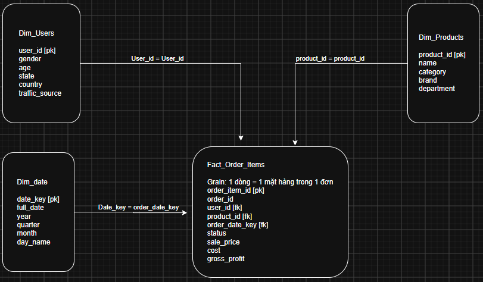

# data-pipeline-project

Dự án học BI + Data Engineering trên BigQuery. Repo gồm hai phần:

1. **Kho dữ liệu dạng star schema** dựng từ dataset công khai `thelook_ecommerce` (dataset `dwh`).
2. **Pipeline thời tiết** chạy bằng Python: gọi API, làm sạch, kiểm tra chất lượng, nạp lên BigQuery (dataset `raw`).

> Trạng thái: đang trong quá trình học (Tuần 1/8). Các phần dbt và dashboard BI sẽ được bổ sung sau.

## Mục tiêu

- Xây pipeline dữ liệu **chạy lại nhiều lần vẫn cho cùng kết quả** (idempotent), có kiểm tra dữ liệu trước khi nạp và có log để truy vết khi lỗi.
- Giữ chi phí gần bằng 0: mọi query đều có giới hạn bytes tính tiền (`maximum_bytes_billed`).
- Không đưa dữ liệu hay bí mật (khóa API) lên repo công khai.

## Luồng dữ liệu của pipeline thời tiết



Nếu bước kiểm tra phát hiện lỗi, pipeline **dừng** và không nạp gì lên BigQuery.

## Sơ đồ bảng

### `raw.weather_daily`

Mỗi dòng là **một thành phố trong một ngày** (3 thành phố × 7 ngày dự báo = 21 dòng).

| Cột | Kiểu | Ý nghĩa |
|---|---|---|
| `time` | DATE | Ngày dự báo |
| `temperature_2m_max` | FLOAT | Nhiệt độ cao nhất trong ngày (°C) |
| `temperature_2m_min` | FLOAT | Nhiệt độ thấp nhất trong ngày (°C) |
| `precipitation_sum` | FLOAT | Tổng lượng mưa trong ngày (mm) |
| `city` | STRING | Tên thành phố |
| `ingested_at` | TIMESTAMP | Thời điểm lấy dữ liệu từ API (UTC) |

Bảng được nạp bằng `WRITE_TRUNCATE` (xóa cũ, ghi mới), nên chạy lại bao nhiêu lần cũng ra đúng 21 dòng, không bị trùng.

### Star schema (`dwh`)



Script tạo dataset: `SQL/Day 2/4_create_dataset_dwh.sql`.

## Cách chạy pipeline thời tiết

**Chuẩn bị**

- Môi trường Python có `requests`, `pandas`, `pyarrow`, `google-cloud-bigquery`.
- Một project Google Cloud và đã đăng nhập: `gcloud auth application-default login`.
- Sửa `PROJECT` ở đầu file `weather_pipeline.py` thành project của bạn, và tạo trước dataset `raw` (location `US`).
- API Open-Meteo không cần khóa.

**Chạy**

```
python "Python/Day 5/weather_pipeline.py"
```

Kết quả: log hiện trên màn hình và được ghi nối thêm vào `logs/weather_pipeline.log`. Pipeline trả mã thoát `0` khi thành công, `1` khi thất bại.

## Cấu trúc thư mục

```
Doc/                      Sơ đồ star schema
SQL/Day 2/                SQL tạo dataset dwh
Python/Day 3/             Gọi API, xử lý lỗi, retry, ghi JSON/CSV/Parquet
Python/Day 4/             Query có giới hạn bytes, nạp DataFrame lên BigQuery, đọc khóa từ .env
Python/Day 5/             weather_pipeline.py (pipeline hoàn chỉnh) và notebook thử nghiệm
.env.example              Mẫu biến môi trường (không chứa khóa thật)
CONTEXT.md, Notes.md      Ghi chú học tập
```

## Lưu ý an toàn

- Khóa API để trong `.env` (đã bị `.gitignore` chặn); chỉ `.env.example` được commit. Pipeline thời tiết hiện không cần khóa, nhưng `.env.example` cho thấy cách làm khi API cần khóa.
- Thư mục `data/` và `logs/` không được commit.
- Mọi query dùng `maximum_bytes_billed` làm cầu chì chi phí.